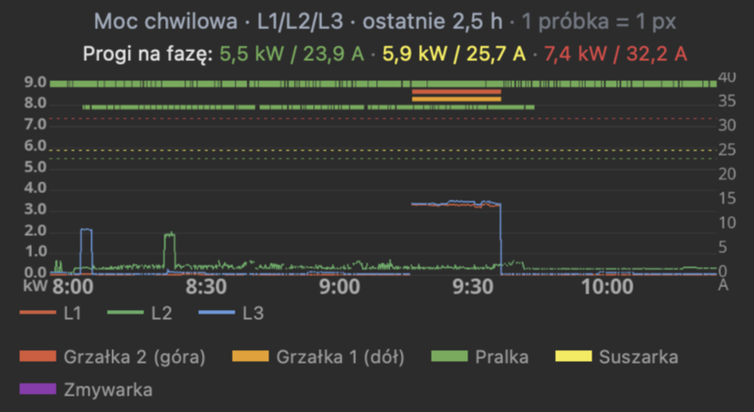
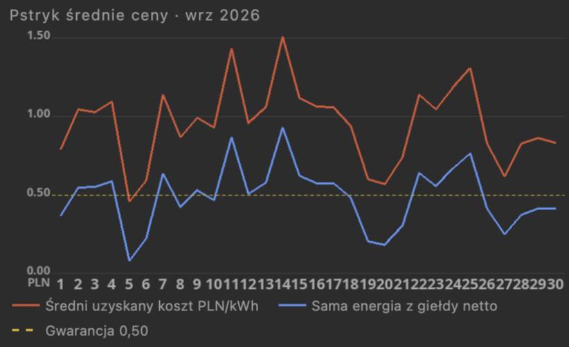
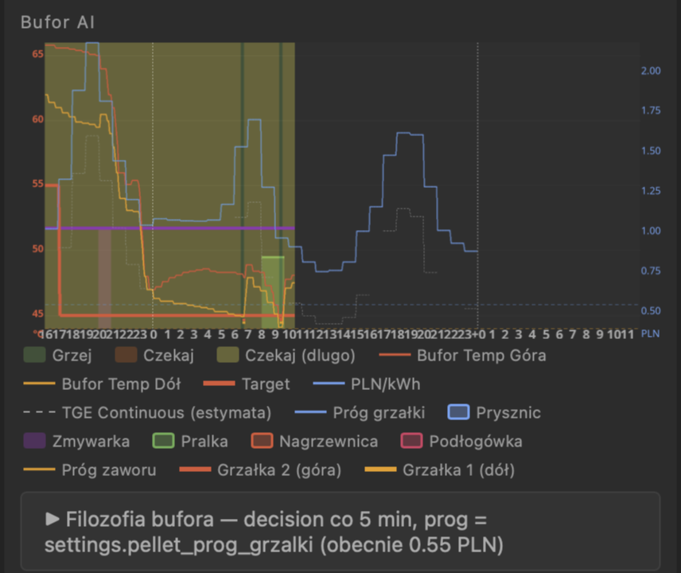
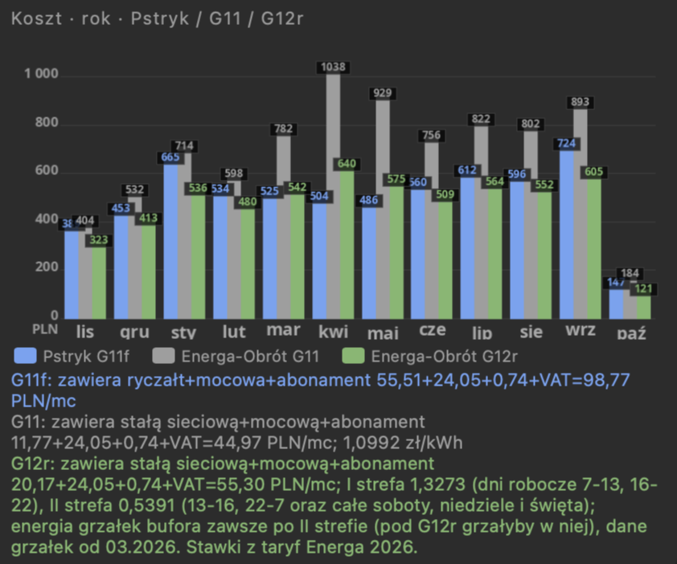

# Pstryk API — import cen, zużycia i kosztów energii

> **Fully coded by Claude AI** — not a single line of code was written manually by a human.

Pobiera z **API Pstryk** godzinowe **ceny dynamiczne**, **zużycie** i **koszty** energii i zapisuje je do MySQL / MariaDB (albo wypisuje jako CSV). Bez bibliotek — jeden plik PHP + dwa skrypty.

Mając te dane u siebie, możesz np.:

- włączać urządzenia (bojler, grzałki, ładowarkę auta, pompę ciepła) w **najtańszych godzinach** — ceny na jutro są dostępne po południu,
- sprawdzić, **ile naprawdę kosztowała** każda godzina, dzień i miesiąc,
- zrobić offline **symulację rachunków** i porównać ceny dynamiczne z taryfami G11 / G12,
- **porównać pomiary** Pstryka z licznikiem operatora (np. [energa-mojlicznik](https://github.com/tymoteuszrogalewski/energa-mojlicznik)).

### Przykład zastosowania — TymOS

Tak wykorzystuję te dane w [TymOS](https://github.com/tymoteuszrogalewski/tymos), moim systemie automatyki domowej:

<br>
*Ceny godzinowe Pstryka w ciągu doby (słupki: zielone tanie, czerwone drogie). Biała ciągła linia to ceny Pstryka na jutro, a zanim Pstryk je opublikuje — biała przerywana, czyli prognoza na podstawie TGE. Niebieska przerywana linia to zużycie domu.*

<br>
*Moc chwilowa na fazach L1/L2/L3 z progami i paskami pracy urządzeń (grzałki w buforze, pralka, suszarka, zmywarka).*

<br>
*Średni uzyskany koszt kWh dzień po dniu na tle samej ceny energii z giełdy i porównanie z gwarancją ceny Pstryka (najwięcej mówi w ujęciu rocznym).*

<br>
*Napięcie na fazach L1/L2/L3 przez całą dobę.*

<br>
*Bufor ciepłej wody grzany grzałkami w najtańszych godzinach — decyzja co 5 minut na podstawie cen Pstryka i prognozy na jutro. Wykres daje pełny obraz pracy bufora: kiedy grzać, a kiedy jeszcze chwilę poczekać, jaki jest w danej chwili cel temperatury i co aktualnie pobiera ciepło z bufora. Widać ładowanie i rozładowanie, co ułatwia późniejsze modyfikacje algorytmu.*

<br>
*Rzeczywiste zużycie przeliczone przez trzy warianty: ceny dynamiczne Pstryk, taryfa Energa G11 i G12r — miesiąc po miesiącu.*

<br>
*Porównanie pomiarów: Pstryk i licznik operatora (moduł [energa-mojlicznik](https://github.com/tymoteuszrogalewski/energa-mojlicznik)).*

*English: hourly dynamic electricity prices, usage and costs from the Polish supplier Pstryk API into MySQL/MariaDB or CSV.*

<h3>Co potrafi:<br>ceny godzinowe (dziś + jutro) · tanie / drogie godziny · pobór i oddanie (PV) · pełne koszty · cała historia · CSV albo baza</h3>

## Pliki

```
go.sh               pobiera wczoraj, dziś i jutro — do crona
history.sh          pobiera historię miesiącami (np. rok, dwa lata)
pstryk.inc.php      biblioteka: pobranie, zapis
pstryk_day.php      to, co uruchamia go.sh
pstryk_history.php  to, co uruchamia history.sh
config.example.php  wzór konfiguracji
schema.sql          tabela pstryk_hourly
```

## Wymagania

- PHP 7.4+ z rozszerzeniami `curl` i `mysqli` (na Debianie / Raspberry Pi OS: `apt install php-cli php-curl php-mysql`)
- klucz API z aplikacji Pstryk
- MySQL / MariaDB — opcjonalnie (bez bazy dane lecą jako CSV); MariaDB 10.6+ / MySQL 8 do zapytań po polu `json`

## Instalacja

```bash
git clone https://github.com/tymoteuszrogalewski/pstryk-api.git
cd pstryk-api
cp config.example.php config.php
nano config.php                     # klucz API, dane bazy
mysql pstryk < schema.sql           # tylko przy zapisie do bazy
```

## Użycie

```bash
./go.sh                             # wczoraj + dziś + jutro
./go.sh 2026-10-05                  # jeden wybrany dzień
./history.sh 2025-01-01             # od 1 stycznia 2025 do dziś
./history.sh 2025-01-01 2025-12-31  # wybrany zakres
```

Historia pobiera się miesiącami (jedno zapytanie = jeden miesiąc), rok to kilkanaście zapytań i kilkadziesiąt sekund. Można przerwać i uruchomić ponownie — wiersze się nadpisują, nic się nie dubluje.

**Ceny** są dostępne także za okres sprzed Twojej umowy z Pstrykiem, **zużycie i koszty** — od jej początku.

**Cron** — co godzinę (zużycie z licznika dochodzi z opóźnieniem, ceny na jutro pojawiają się po południu):

```
15 * * * *  /sciezka/pstryk-api/go.sh >/dev/null
```

**Tryb CSV** — ustaw `DB_NAME` na `''`. Kolumny jak w tabeli poniżej, bez `json`, rozdzielone `;`.

## Tabela

| kolumna | znaczenie |
|---|---|
| `ts_utc` | początek godziny, UTC (klucz) |
| `ts_local` | początek godziny, czas polski — `14:00` = 14:00–15:00 |
| `price_gross` | pełna cena brutto zł/kWh (energia + dystrybucja + opłata Pstryka + akcyza + VAT) |
| `price_tge` | cena energii na giełdzie TGE, netto zł/kWh |
| `price_prosumer_gross` | cena sprzedaży energii (prosument), brutto zł/kWh |
| `is_cheap` / `is_expensive` | 1 = tania / droga godzina według Pstryka |
| `kwh_import` / `kwh_export` | pobór z sieci / oddanie do sieci, kWh |
| `cost_import` | pełny koszt poboru brutto, zł |
| `cost_energy_net` | sam koszt energii netto (bez dystrybucji i opłat), zł |
| `value_sold` | wartość energii oddanej, zł |
| `cost_balance` | bilans: koszt poboru − wartość oddanej, zł |
| `json` | cała odpowiedź API dla godziny — wszystkie składniki cen i kosztów |

Ceny jeszcze nieznane (jutro przed publikacją) zapisują się jako `NULL` i uzupełniają przy kolejnym uruchomieniu. Kluczem jest czas UTC, bo przy zmianie czasu na zimowy godzina 02:00 występuje dwa razy.

```sql
-- koszt i zużycie dzienne
SELECT DATE(ts_local) dzien, SUM(kwh_import) kwh, SUM(cost_import) zl
FROM pstryk_hourly GROUP BY dzien ORDER BY dzien DESC;

-- 5 najtańszych godzin jutro
SELECT ts_local, price_gross FROM pstryk_hourly
WHERE DATE(ts_local) = CURDATE() + INTERVAL 1 DAY ORDER BY price_gross LIMIT 5;

-- dowolny składnik z JSON, np. stawka dystrybucyjna
SELECT ts_local, JSON_VALUE(json, '$.pricing.dist_price') FROM pstryk_hourly ORDER BY ts_utc DESC LIMIT 24;
```

## Uwagi

- API ma limit zapytań — przy odpowiedzi `429` skrypt odczekuje minutę i ponawia. Nie uruchamiaj crona częściej niż co kilkanaście minut.
- Pstryk nie jest powiązany z tym projektem; korzystasz z własnego klucza API na własną odpowiedzialność.

## Pochodzenie

Moduł wydzielony z [TymOS](https://github.com/tymoteuszrogalewski/tymos) — lekkiego systemu automatyki domowej na Raspberry Pi.

## Licencja

MIT — patrz [LICENSE](LICENSE).
